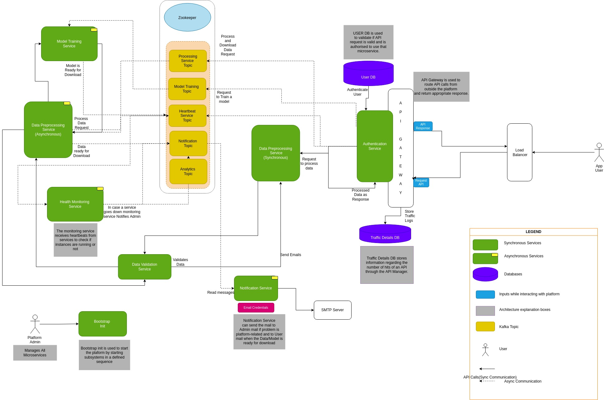

# AutoDP: Automated Data PreProcessing and Machine Learning Platform

## Description

This Automated Data Preprocessing and Model Training Platform is a user-friendly, no-code solution that empowers users to effortlessly upload, manipulate, and analyze their datasets while seamlessly training machine learning models. With an intuitive interface, it eliminates the need for manual coding and simplifies data preprocessing, model selection, and hyperparameter tuning. This platform ensures data professionals and domain experts can efficiently navigate the machine learning pipeline, fostering data-driven insights and rapid model development for a wide range of applications.

## Architecture Diagram

## Folder Structure

- `client`: client side code.
  - `src`: Source code.
- `microservices`: Microservices/Components
  - `Data Processing Service`: Performs data preprocessing.
  - `Data Processing Service`: Validates the submitted data.
  - `Model Training Service`: Trains ML Model.
  - `Notification Service`: Notifies on trigger.
  - `Health Monitoring Service`: Keeps track of system health.
  - `Notification Service`: Notifies on trigger.

## Contributions

Contributions to this project are welcome! If you find any issues or have ideas for improvements, please feel free to open an issue or submit a pull request.

Let's make Kaoaa even better together!
